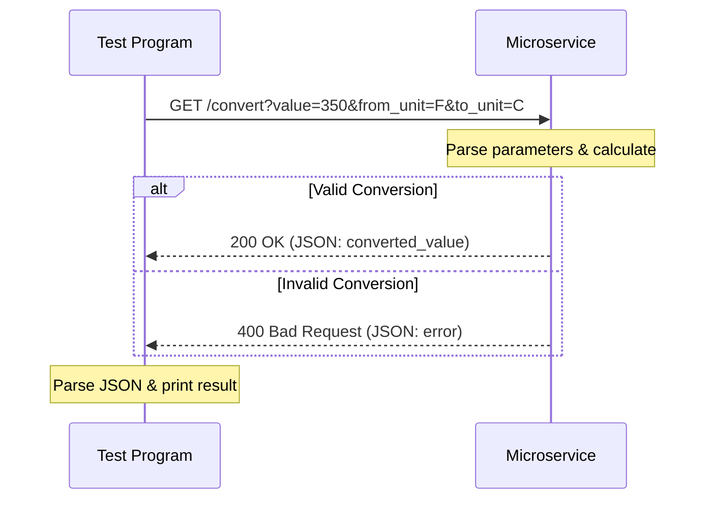

# Unit Conversion Microservice

This microservice allows you to convert temperature and volume. 
Communication pipe: REST API. 
Where you send a HTTP GET request, get a JSON response.

## REQUEST

Send a GET request to `/convert` with three query parameters: `value` (float), `from_unit` (string), and `to_unit` (string).

`GET http://localhost:5000/convert?value=ORIGINAL_VALUE&from_unit=ORIGINAL_UNIT&to_unit=TARGET_UNIT`

Example call:

```python
import requests

response = requests.get(
    "http://localhost:5000/convert",
    params={"value": 350, "from_unit": "F", "to_unit": "C"}
)
```

Units Available:
Temperature: F and C 
Volume: ml, l, tsp, tbsp, fl_oz, and cup

## RECEIVE

This microservice returns JSON data.
Success: returns a 200 with the original data and the converted result.
Invalid: returns a 400 with an error message.

Success (200):

```json
{
  "original_value": 350,
  "original_unit": "F",
  "converted_value": 176.67,
  "converted_unit": "C"
}
```

Error (400):

```json
{
  "error": "Invalid unit conversion requested"
}
```

Example call:

```python
if response.status_code == 200:
    print(response.json()["converted_value"])
else:
    print(response.json()["error"])
```

## UML Sequence Diagram

